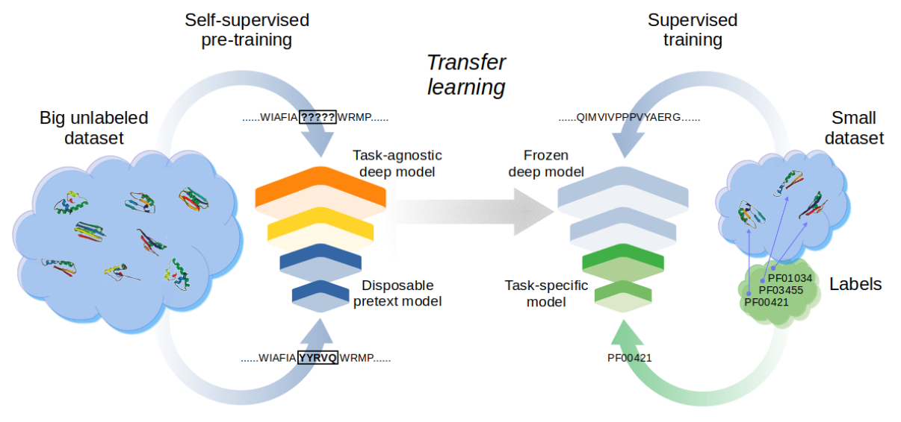

# Transfer learning to annotate the protein universe
This is the source code for experiments in “Transfer learning: the key to functionally annotate the protein universe,” by L. A. Bugnon, E. Fenoy, A. Edera, J. Raad, G. Stegmayer and D.H. Milone. Patterns, Cell Press, 2023. https://doi.org/10.1016/j.patter.2023.100691

## Installation

First, download the repository or clone it with 

	git clone https://github.com/sinc-lab/transfer-learning-pfam.git

We recommend using a python virtual environment such as [conda](https://docs.conda.io/en/latest/miniconda.html) or venv. For example, with conda:

	conda create -n tlpfam python
	conda activate tlpfam

Now on this environment it is better to install pytorch first (it may depend on your hardware setup, follow [these recommendations](https://pytorch.org/get-started/locally/))

    pip install torch

Move to the repository folder and install the required packages
    
    pip install -r requirements.txt

## Run a quick verification demo

Since embedding sequences takes some time, precomputed embeddings are provided. You can download them  for dev and test partitions from [here](https://drive.google.com/drive/folders/1M3tDoyA04k6Ucnhq3b-0MLJdAuhg4LZX). Copy and unzip all the files on root folder (`transfer-learning-pfam/`). This contains the sequences and labels as well. 

To check if everything is ok, a fast converging model can be trained using only the dev partition. Go to `transfer-learning-pfam/` directory and run

    python train.py --train data/Clustered_data/dev/ --dev data/Clustered_data/dev/

To evaluate all models in the folder, run

    python test.py

## Reproducing results

To reproduce the results of the paper, compute the embeddings for train sequences with the following

    python compute_embeddings.py -i data/Clustered_data/train/

Then, train a TL-ProtCNN-ensemble of 5 models with the full dataset

    python train.py --train data/Clustered_data/train/ --dev data/Clustered_data/dev/ -n 5

For reference, one model takes about a day to converge using a RTX A5000 GPU.

Using the test script you can see the results for each model individually, and the ensemble with all the trained models found in the folders named as `results_*` 

    python test.py
